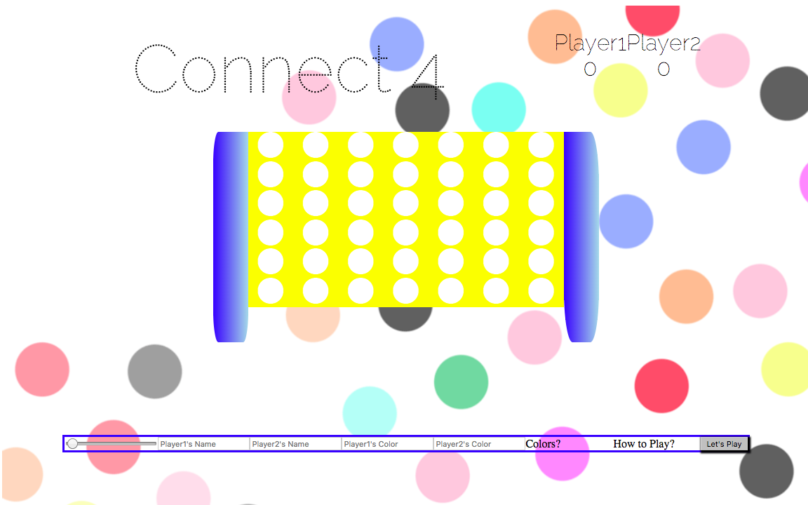
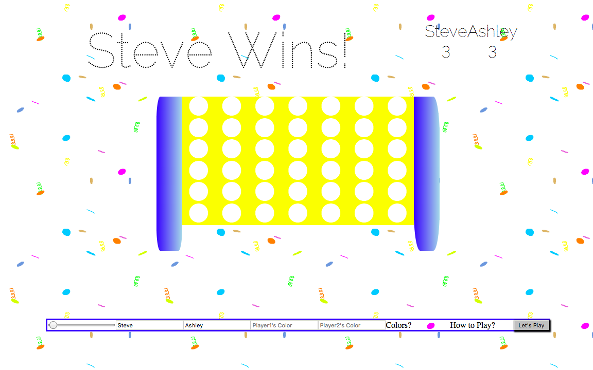
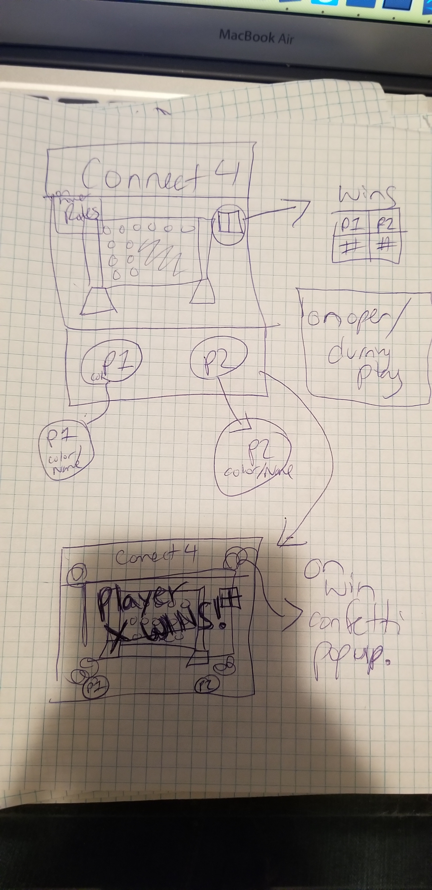

My first project is connect 4, a game with 35 squares you alternate player turns putting pieces on the board. The first to get 4 pieces in a row vertically, horizontally, or diagonally wins!!

Technologies Used: 
-JQUERY, HTML, CSS, Javascript
-Trello for for project planning/management

SITE LINK: https://laughing-babbage-545d51.netlify.com/
TRELLO LINK: https://trello.com/b/nV5jL4yB/project1-connect4

knock out text for styling courtesy of https://css-tricks.com/how-to-do-knockout-text/ 
Gifs by https://giphy.com/

In Version 2 I would like to add :
An AI option
Different Background options
animations where the pieces look like they're being put in from the top/falling in to their spots.
